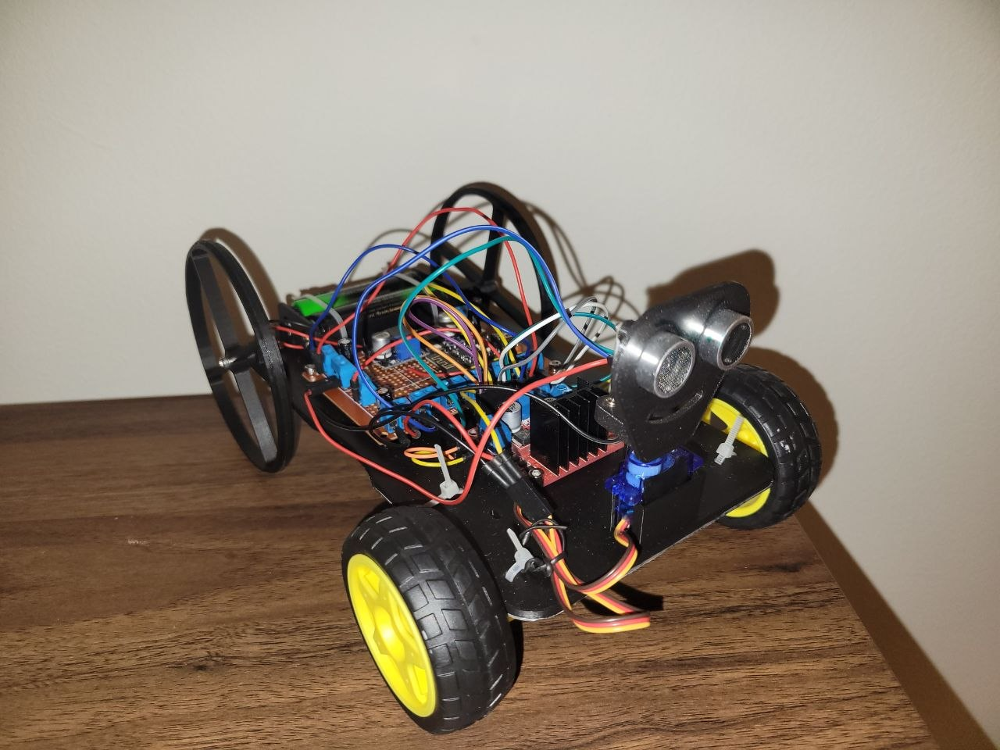
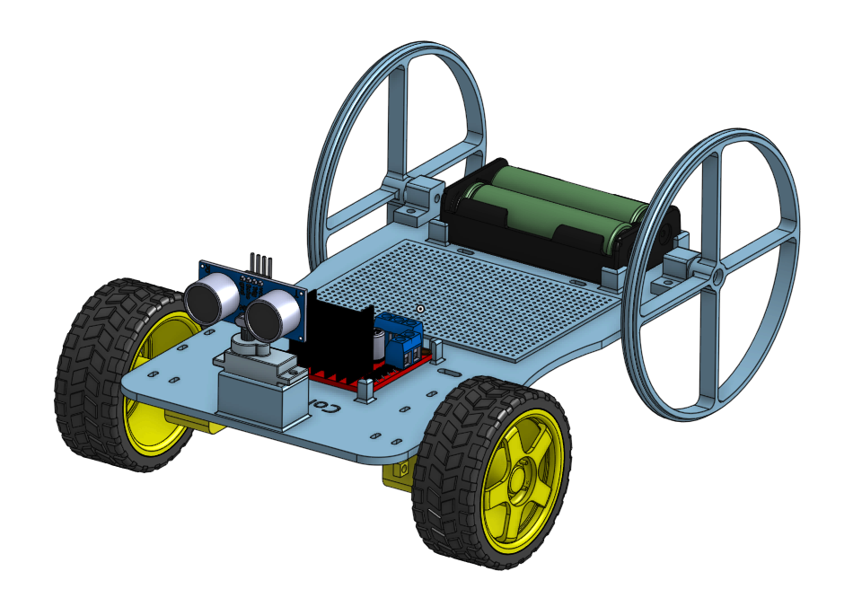
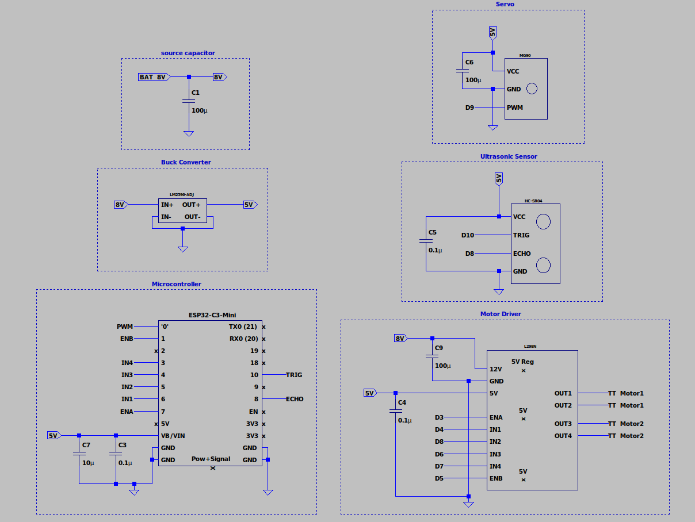

# Cornelius Autonomous Rover

#### This project uses an ESP32 microcontroller, ultrasonic sensor, servo motor, and a custom wireless controller to create an obstacle-avoiding and manually-driven rover called **Cornelius**. The rover communicates with the controller over ESP-NOW and supports both autonomous obstacle avoidance and real-time manual control. Included are STL files for 3D printing, a circuit schematic, images, and a parts list. The project is divided into Mechanical, Electrical, and Programming sections for clarity. 

---

## Table of Contents
1. [Parts List](#parts-list)
2. [Mechanical](#mechanical)
3. [Electrical](#electrical)
4. [Programming](#programming)
5. [Movement Logic](#movement-logic)
6. [Usage](#usage)
7. [Legacy Version](#legacy-version)

---

### Image of Rover:


---

## Parts List:

**Rover:**
- WeAct Studio ESP32-C3Fx4 Mini Core
- HC-SR04 ultrasonic distance sensor
- 2× TT DC gear motors
- 2× TT motor wheels
- Two port screw terminals
- L298N motor driver
- Micro servo (sg90)
- 2× 18650 Li-ion batteries (with holder)
- 3x 100 uF electrolytic capacitor
- 3x 0.1 uF ceramic capacitor
- 1x 10 uF ceramic capacitor
- LM2596 adjustable buck converter set to 5V
- dupont jumper wires
- 3D-printed chassis, wheels, and wheel mounts (PLA)
- Zipties
- bolts, washers, bearings (for wheel mounting)
- Electrical tape (for servo fitment)

**Controller:**
- WeAct Studio ESP32-C3Fx4 Mini Core
- Analog joystick module
- Push button (mode toggle)
- Green and red LEDs
- Custom PCB (see [Electrical](#electrical))
- 3D-printed enclosure (optional)

---

## Mechanical:
The chassis is custom-designed, and the wheels are inspired by a design from Prof. Wolken at Irvine Valley College. The ultrasonic sensor bracket is not included in this repository — many suitable brackets can be found online (e.g., searching "HC-SR04 bracket" on Printables).

- **Printing:** Chassis, wheels, and wheel mounts were 3D printed with PLA
- **Chassis Features:**
  - Holes for zipties to secure motors and components
  - Holes for routing TT motor wires to the motor driver
  - Bracket for the servo motor
- **Wheels & Mounts:**
  - Front wheels mounted to motors with zipties
  - Rear wheel mounts printed separately and attached via bolts through the chassis
  - Rear wheels attached via bolts through the mount bracket and two bearings for each
- **Component Mounting:** Motor driver and battery holder secured with tabs on the chassis
- **Ultrasonic Sensor:** Custom bracket (found online) reinforced with screws and washers for stability
- **Servo Motor:** MG90 (metal gears, overkill for this project — an SG90 or similar plastic gear servo works fine)
- **Notes:** Some wheel wobbling may occur, especially during extended operation

#### Assembly on Onshape:



*The Onshape assembly file shows the rough placement of parts. Components are not fully constrained or mated, so this is meant as a visual reference only. Assembly file is provided.*

---

## Electrical:
The rover is powered by two 18650 Li-ion batteries in series (nominal 3.7 V each, 7.4 V total).

**Rover:**
- **Voltage Considerations:**
  - ESP32 VIN: 5V from buck converter
  - SG90 servo: 5V from buck converter
  - Actual battery voltage ~8 V, sufficient for this setup
- **Motors:** TT motors (3–6 V), voltage drop across the motor driver brings them into the safe range
- **Logic Power:** L298N motor driver has a built-in 5 V regulator which powers the ESP32, HC-SR04, and servo
- **Capacitors:** Placing them across the power rail and GND smooths voltage spikes, refer to the schematic for locations
- **Wiring:** Dupont jumper wires were used. Ensure solid connections to avoid intermittent failures
- **Current Draw:** Total current should realistically not exceed 2 A

**Controller:**
- A custom PCB was designed for the controller to clean up wiring and keep the build compact. PCB design files (schematic, layout, Gerbers) are hosted in a separate repository: [Controller PCB Repo](https://github.com/rjafari44/ESP32-Remote-Control-PCB)
- The controller is powered separately (USB or onboard regulation depending on your build)

#### Circuit Schematic:



---

## Programming:
The rover and controller each run on separate ESP32 boards and communicate wirelessly over **ESP-NOW** on channel 1. The controller sends a `ControlData` packet at 30 ms intervals containing joystick X/Y values and a mode flag. The rover acts on each packet immediately or stops if no packet is received within the failsafe window.

```cpp
typedef struct {
  int  x;
  int  y;
  bool autonomous;
} ControlData;
```

Both codebases are split across multiple `.cpp` files with a shared `common.h`.

**Rover files:**
| File | Purpose |
|---|---|
| `rover.ino` | Setup, main loop, failsafe, variable definitions |
| `control.cpp` | `manualControl()` and `autonomousDrive()` logic |
| `move.cpp` | Motor direction functions |
| `distance.cpp` | Ultrasonic sensor averaging |
| `look.cpp` | Servo sweep left/right for obstacle scanning |
| `data.cpp` | ESP-NOW receive callback |
| `common.h` | Pins, constants, struct, extern declarations |
| `servoDeclare.h` | Servo object declaration |

**Controller files:**
| File | Purpose |
|---|---|
| `controller.ino` | Setup, main loop, button handling, variable definitions |
| `input.cpp` | `proportional()` joystick scaling |
| `led.cpp` | `updateLEDs()` direction indicators |
| `common.h` | Pins, constants, struct, extern declarations |

- **Compilation:** Arduino IDE or Arduino CLI
- **Shell Script:** Provided (`run.sh`) to simplify CLI compilation. Ensure it has executable permissions (`chmod +x run.sh`)

---

### Failsafe:
If the rover does not receive a packet within `FAILSAFE_MS` (500 ms), it stops all motors until communication resumes:

```cpp
if (!hasPacket || millis() - lastPacketTime > FAILSAFE_MS) {
  stopMotors();
  return;
}
```

---

### Mode Switching:
The joystick button toggles between **manual** and **autonomous** mode. The `autonomous` flag is packed into every ESP-NOW transmission and read on the rover side each loop:

```cpp
autonomousMode = rx.autonomous;

if (autonomousMode) {
  autonomousDrive();
} else {
  manualControl(rx.x, rx.y);
}
```

Both LEDs lighting up simultaneously on the controller indicates autonomous mode is active.

---

### Manual Control:
Joystick input is read, smoothed with a rolling average, and mapped through `proportional()` to correct for the off-center neutral point of the joystick:

```cpp
lastX = (lastX * 3 + x) / 4;
lastY = (lastY * 3 + y) / 4;

int mappedX = proportional(lastX, CENTER_X, DEADZONE);
int mappedY = proportional(lastY, CENTER_Y, DEADZONE);
```

On the rover, the dominant axis wins — if vertical deflection is greater than horizontal, the rover moves forward or backward; otherwise it turns:

```cpp
if (abs(y) >= abs(x)) {
  // forward / backward
} else {
  // turn left / right
}
```

---

### Autonomous Drive:
In autonomous mode the rover moves forward freely until an obstacle is detected within `OBSTACLE_LIMIT` (20 cm). It also performs a proactive sweep every `SWEEP_INTERVAL` (5 seconds) even on a clear path, nudging toward whichever side has more room:

```cpp
if (now - lastSweepTime >= SWEEP_INTERVAL) {
  int leftDist  = lookLeft();
  int rightDist = lookRight();

  if (leftDist > rightDist + 10)       { turnLeft();  delay(200); }
  else if (rightDist > leftDist + 10)  { turnRight(); delay(200); }
}
```

When an obstacle is detected, the rover stops, backs up, then scans left and right with the servo to pick the clearer direction:

```cpp
int leftDist  = lookLeft();
int rightDist = lookRight();

if (leftDist < OBSTACLE_LIMIT && rightDist < OBSTACLE_LIMIT) {
  moveBackward();   // both blocked — keep reversing
  return;
}

if (leftDist > rightDist) { turnLeft(); }
else                       { turnRight(); }
```

---

## Movement Logic:

| Movement   | IN1 | IN2 | IN3 | IN4 | ENA | ENB |
|------------|-----|-----|-----|-----|-----|-----|
| Forward    | 0   | 1   | 0   | 1   | PWM | PWM |
| Backward   | 1   | 0   | 1   | 0   | PWM | PWM |
| Turn Left  | 1   | 0   | 0   | 1   | PWM | PWM |
| Turn Right | 0   | 1   | 1   | 0   | PWM | PWM |
| Stop       | —   | —   | —   | —   | 0   | 0   |

**0 = Low**\
**1 = High**\
**PWM = 0–255 analog value (set via `MOTOR_SPEED` constant)**

---

## Usage:

#### 1. Flash Both Boards
Flash `rover.ino` to the rover ESP32 and `controller.ino` to the controller ESP32. Make sure both are on the same ESP-NOW channel (channel 1 by default) and that the rover's MAC address in `controller.ino` matches your actual hardware.

#### 2. Find Connected Serial Port

**On Linux:**
```bash
ls /dev/tty*
```

**With Arduino CLI (recommended):**
```bash
arduino-cli board list
```

#### 3. Run the Programs
Separate shell scripts are provided for each board. Ensure they have executable permissions before running:

```bash
chmod +x run_rover.sh run_controller.sh
```

**Rover:**
```bash
./run_rover.sh
```

**Controller:**
```bash
./run_controller.sh
```

---

## Legacy Version

An earlier version of Cornelius ran on an **Arduino Nano** with no wireless controller and supported only autonomous obstacle avoidance. That version is preserved in the [`legacy/`](legacy/) directory at the root of this repository.
